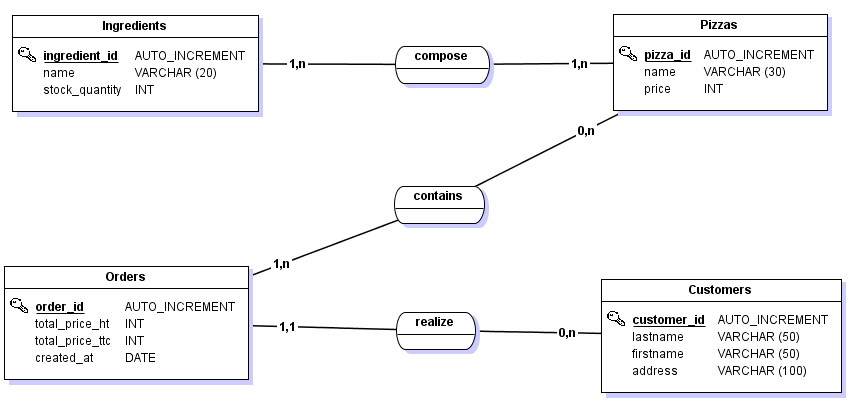

# 2.2 Modèle Conceptuel des Données (MCD)

<blockquote>
    <h2>Prérequis</h2>
    <p>Compréhension des principes de base de la modélisation de données et familiarité avec les concepts fondamentaux tels que les entités et les relations.</p>
</blockquote>

<blockquote>
    <h2>Objectifs pédagogiques</h2>
    <ul>
        <li>Définir ce qu'est un Modèle Conceptuel des Données (MCD) et son rôle dans MERISE.</li>
        <li>Identifier les composantes clés d'un MCD, incluant les entités, les attributs, et les relations.</li>
        <li>Comprendre les étapes pour la création d'un MCD efficace dans le cadre d'un projet de système d'information.</li>
    </ul>
</blockquote>

---

Le Modèle Conceptuel des Données (MCD) est une composante cruciale de la méthode MERISE, représentant une étape fondamentale dans la conception des systèmes d'information. Il offre une vue globale et abstraite des informations que le système doit gérer, sans prendre en compte les contraintes techniques liées à la base de données.


## 2.2.1 Définition et Importance

Le MCD est un outil de modélisation qui décrit de façon structurée et cohérente les données importantes pour un système d'information, ainsi que les liens logiques entre ces données. Il sert de fondation pour le développement ultérieur des modèles logiques et physiques des données, en assurant une compréhension claire et unifiée des informations à gérer.

## 2.2.2 Composantes Clés du MCD

- **Entités** : Objets ou concepts du monde réel qui seront représentés dans le système d'information. Chaque entité est caractérisée par un ensemble d'attributs.
- **Attributs** : Propriétés qui décrivent les caractéristiques des entités.
- **Relations** : Liens logiques entre les entités, illustrant la façon dont elles interagissent entre elles.
- **Cardinalités** : Description du nombre de relations entre les entités, essentielle pour définir la nature des interactions (un à un, un à plusieurs, plusieurs à plusieurs).


## 2.2.2 Étapes de Création d'un MCD

1. **Identification des Entités** : Déterminez les principaux concepts ou objets qui doivent être représentés dans le système.
2. **Définition des Attributs** : Identifiez les propriétés importantes de chaque entité.
3. **Établissement des Relations et Définition des Cardinalités** : Déterminez comment les entités sont liées les unes aux autres et précisez la cardinalité pour chaque relation (un à un, un à plusieurs, plusieurs à plusieurs). Cette étape est essentielle pour comprendre les interactions détaillées entre les entités.
4. **Validation du Modèle** : Vérifiez la cohérence et la complétude du MCD avec les utilisateurs finaux et les parties prenantes du projet.


## 2.2.3 Notion de Cardinalité

La cardinalité est un aspect crucial dans la modélisation des relations entre entités dans un MCD. Elle décrit le type et le nombre de relations entre les entités, permettant de préciser combien d'instances d'une entité peuvent être associées à combien d'instances d'une autre entité. La compréhension et l'application correctes de la cardinalité sont essentielles pour assurer l'intégrité et la pertinence des données dans le système d'information.

- **Types de Cardinalité** :
  - **Un à un (1:1)** : Chaque instance d'une entité est associée à une seule instance de l'autre entité.
  - **Un à plusieurs (1:N)** : Une instance d'une entité peut être associée à plusieurs instances d'une autre entité, mais chaque instance de cette autre entité est associée à une seule instance de la première entité.
  - **Plusieurs à plusieurs (N:M)** : Des instances d'une entité peuvent être associées à plusieurs instances d'une autre entité, incluant la possibilité que certaines instances ne soient liées à aucune instance de l'autre côté.

La distinction entre ces types de relations et la définition précise de la cardinalité pour chaque relation dans un MCD sont fondamentales pour la conception efficace de bases de données relationnelles et pour le développement ultérieur des modèles logiques et physiques des données.


## 2.2.3 Exemple de MCD : Pizzeria

Imaginons que nous devons concevoir le système d'information pour une pizzeria. Notre objectif est de gérer efficacement les commandes, les clients, et le menu.

### Étape 1 : Identification des Entités

- **Client** : Chaque client qui passe une commande dans la pizzeria.
- **Commande** : Les commandes passées par les clients.
- **Pizza** : Les différents types de pizzas proposées par la pizzeria.
- **Ingrédient** : Les ingrédients utilisés pour préparer les pizzas.

### Étape 2 : Définition des Attributs

- **Client** : Nom, Adresse, Téléphone.
- **Commande** : Numéro de Commande, Date, Montant Total.
- **Pizza** : Nom de la Pizza, Prix.
- **Ingrédient** : Nom de l'Ingrédient, Quantité en stock.

### Étape 3 : Établissement des Relations avec les Entités et Cardinalités

- **Client --(1:N)-- Commande** : Un client peut passer plusieurs commandes (1:N), mais chaque commande est spécifiquement passée par un seul client.
  
- **Commande --(N:M)-- Pizza** : Une commande peut contenir plusieurs types de pizzas, et une pizza peut être incluse dans plusieurs commandes, reflétant une relation plusieurs à plusieurs (N:M).

- **Pizza --(N:M)-- Ingrédient** : Une pizza est composée de plusieurs ingrédients, et un ingrédient peut être utilisé dans plusieurs pizzas, indiquant également une relation plusieurs à plusieurs (N:M).

#### Application de la Cardinalité dans le MCD

La définition précise de ces cardinalités est cruciale pour comprendre les quantités minimales et maximales d'associations entre les entités. Cela aide à concevoir la base de données sous-jacente de manière à refléter fidèlement les règles métier de la pizzeria. Par exemple, la cardinalité N:M entre "Commande" et "Pizza" nécessitera une table d'association pour gérer les multiples liaisons entre ces entités dans une base de données relationnelle.

#### Schéma du MCD 



```
Client --(1:N)-- Commande --(N:M)-- Pizza --(N:M)-- Ingrédient
```

- La relation "1:N" entre "Client" et "Commande" signifie qu'un client peut passer zéro, une ou plusieurs commandes, mais chaque commande est liée à un seul client.
- La relation "N:M" entre "Commande" et "Pizza" ainsi qu'entre "Pizza" et "Ingrédient" montre la flexibilité et la complexité des choix possibles, nécessitant une gestion attentive des associations dans la conception de la base de données.


## Résumé

- **Rôle du MCD** : Établir une vue globale et structurée des données d'un système d'information, indépendamment des aspects techniques de mise en œuvre.
- **Composantes Clés** :
  - **Entités** : Objets ou concepts du monde réel représentés dans le système.
  - **Attributs** : Caractéristiques définissant les propriétés des entités.
  - **Relations** : Liens entre les entités décrivant comment elles interagissent.
  - **Cardinalités** : Décrit le type et le nombre de relations entre entités, essentielle pour la modélisation précise des interactions.
- **Processus de Création** :
  1. Identification des entités.
  2. Définition des attributs pour chaque entité.
  3. Établissement des relations entre les entités.
  4. Validation du modèle pour assurer sa cohérence et sa complétude.
- **Importance** : Le MCD est essentiel pour comprendre la structure des données et sert de fondation à la modélisation logique et physique.

